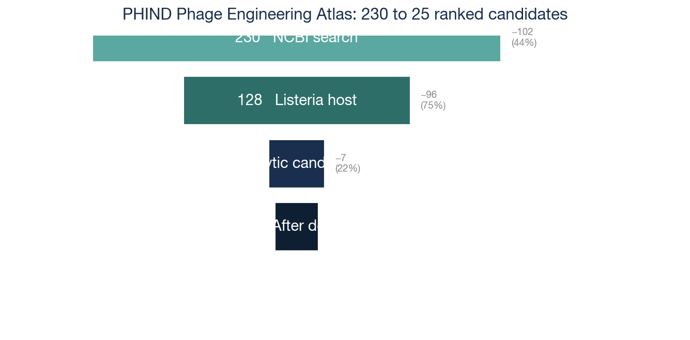
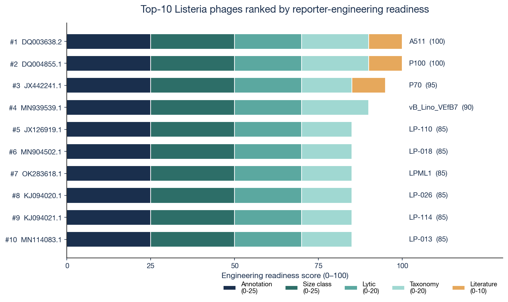
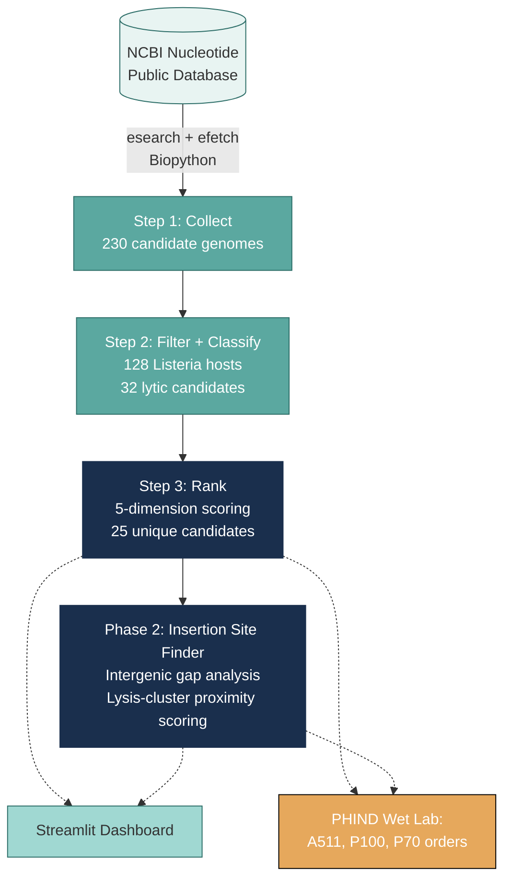
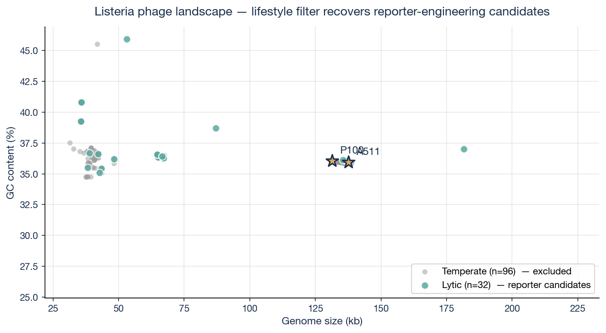

<div align="center">

# 🧬 PHIND Phage Engineering Pipeline

**An open-source pipeline that ranks bacteriophages for reporter-phage engineering, identifies safe luciferase insertion sites, predicts host range, and designs optimal phage cocktails — built to support the PHIND food-safety screening platform.**


[](https://github.com/crystalzys43/PHIND-phage-engineering)



</div>

---

## At a glance

> Starting from every publicly sequenced *Listeria* phage genome in NCBI, this pipeline filters by host specificity, classifies lifestyle, deduplicates against RefSeq, and ranks candidates on five biological criteria — producing an evidence-backed wet-lab ordering list for PHIND's reporter-phage development.

**Top 5 reporter-phage candidates** (full ranking in `results/candidate_phages_ranked.csv`):

| Rank | Score | Accession | Phage | Why this matters |
|---:|---:|---|---|---|
| 1 | 100/100 | DQ003638.2 | **A511** | Loessner 1996 — the original luxAB reporter phage backbone |
| 2 | 100/100 | DQ004855.1 | **P100** | FDA-approved LISTEX biocontrol; mature safety dossier |
| 3 | 95/100 | JX442241.1 | P70 | Klumpp 2014 characterization |
| 4 | 90/100 | MN939539.1 | vB_Lino_VEfB7 | Recently characterized A511-like giant |
| 5 | 85/100 | JX126919.1 | LP-110 | Mid-size, broadly representative of LP-series |

The pipeline **independently rediscovered A511 and P100** as top candidates — matching three decades of published reporter-phage literature, but from public genomic data alone.



---

## The four scientific questions

PHIND is a phage-based bacterial contamination screening platform for food manufacturing QA. Building it requires engineering **reporter phages** — phages modified to produce a measurable signal (luciferase) when they infect target food pathogens. Before any wet-lab work begins, four decisions have to be made:

1. **Which phage** should we engineer as the reporter backbone?
2. **Where** in its genome should we insert the luciferase reporter?
3. **Which bacterial strains** will the engineered phage actually detect?
4. **What cocktail** of phages should the PHIND cartridge contain?

This pipeline answers each of those questions using publicly available phage genomic data.

---

## Project Roadmap

| Phase | PHIND Question | Module | Status |
|---|---|---|---|
| **1. Atlas** | Which phage to engineer? | `src/atlas/` | ✅ Complete |
| **2. Insertion Site Finder** | Where to insert luciferase? | `src/insertion/` | 🚧 v1 complete; Pharokka re-annotation planned |
| **3. Host Range Predictor** | Which strains can it detect? | `src/host_range/` | 📋 Planned |
| **4. Cocktail Designer** | What cocktail composition? | `src/cocktail/` | 📋 Planned |

### Interactive dashboard

```bash
streamlit run dashboard/app.py
```

Opens a local browser dashboard with five tabs: ranked candidates, score breakdown, genome landscape, phage detail card, and Phase 2 insertion sites with linear genome maps.

---

## Pipeline architecture



---

## Listeria phage landscape

The pipeline doesn't just produce a number — it makes the biology visible. The plot below shows the full set of phage genomes by size and GC content, color-coded by lifestyle. A511 and P100 (gold stars) sit at the apex of the giant *Herelleviridae* clade and emerge naturally as top engineering candidates.



---

## Phase 1: Listeria Phage Atlas

The first deliverable is a ranked, searchable atlas of every publicly sequenced *Listeria* phage, annotated with the features that matter for reporter-phage engineering:

- Genome size and GC content
- Lytic vs. temperate lifestyle (transparent gene-content heuristic)
- Functional gene annotation (planned: Pharokka)
- Reported host range (planned: INPHARED metadata)
- Genome similarity clusters (planned: mash distance)
- Engineering-readiness score (planned: composite ranking)

**Output:** a CSV of ranked candidates and an interactive Streamlit dashboard.

### Progress so far

| Step | Script | Records | Outcome |
|---|---|---|---|
| 1. Collect genomes | `src/atlas/01_collect_genomes.py` | 230 candidate phage genomes from NCBI | `data/listeria_phages.csv` |
| 2. Filter + classify lifestyle | `src/atlas/02_classify_lifestyle.py` | 230 → 128 Listeria hosts → **32 lytic reporter candidates** | `data/listeria_phages_classified.csv` |
| 3. Rank by engineering readiness | `src/atlas/03_rank_candidates.py` | 32 lytic → 25 unique → **ranked 1–25** | `results/candidate_phages_ranked.csv` |

### Phase 1 final output: top 5 PHIND reporter-phage candidates

| Rank | Score | Accession | Phage | Why this matters |
|---:|---:|---|---|---|
| 1 | 100/100 | DQ003638.2 | **A511** | Loessner 1996 — the original luxAB reporter phage backbone |
| 2 | 100/100 | DQ004855.1 | **P100** | FDA-approved LISTEX biocontrol; large existing safety dossier |
| 3 | 95/100 | JX442241.1 | P70 | Group B Listeria phage; Klumpp 2014 characterization |
| 4 | 90/100 | MN939539.1 | vB_Lino_VEfB7 | Recently characterized giant; similar architecture to A511 |
| 5 | 85/100 | JX126919.1 | LP-110 | Mid-size, broadly representative of LP-series |

PHIND wet-lab implication: start with **A511** as primary backbone (deepest reporter-engineering literature), **P100** as secondary (regulatory advantages), and the **LP-series** as cocktail-diversity options.

---

## Phase 2: Insertion Site Finder (v1)

For the top-10 ranked phages, Phase 2 identifies intergenic regions where a luciferase cassette could be inserted without disrupting the lytic cycle.

### Scoring biology

Each candidate site scores 0–100 across four criteria:

- **Gap size** (≥1 kb comfortable; ≥500 bp tight; ≥50 bp minimal)
- **Flank essentiality** (neither essential = best; both essential = excluded)
- **Lysis-cluster proximity** (adjacent to endolysin/holin = preferred; this is the published Loessner 1996 A511-*luxAB* insertion locale)
- **Permissive-flank bonus** (hypothetical-protein flanks are safest)

Gene categories (essential / lysis / permissive / other) are assigned by keyword matching on NCBI CDS product names.

### Findings & known limitation

- For phages with rich functional annotation (P70, LP-series, vB_Lino_VEfB7), Phase 2 successfully identifies sites adjacent to endolysin / lysis cluster — the textbook Loessner insertion locale.
- For **A511 and P100**, the NCBI records use minimal gene-product names (`gp1`, `gp2`, …) without functional descriptions, so our keyword classifier cannot categorize flanks. Their top sites cap at 55/100 — a *data-annotation* artifact, not a biological deficiency.
- **Phase 2 next step:** re-annotate the top-5 candidates with [Pharokka](https://github.com/gbouras13/pharokka) to recover functional categories and produce calibrated insertion scores across all candidates.

### Step 2 sanity check

The Step 2 classifier rediscovered **A511** and **P100** as top candidates from the raw public data — these are the same two phages the Listeria reporter-phage literature has converged on since 1996. This validates that the lifestyle-classification heuristic captures the right biology.

**Top 5 lytic Listeria phages by genome size:**

| Accession | Size (bp) | Phage | Note |
|---|---:|---|---|
| OQ999172.1 | 181,606 | LIS04 | Giant Herelleviridae |
| DQ003638.2 | 137,619 | **A511** | Loessner 1996 reporter backbone |
| MN939539.1 | 135,461 | vB_Lino_VEfB7 | Recent giant |
| DQ004855.1 | 131,384 | **P100** | FDA-approved LISTEX biocontrol |
| OK283618.1 | 87,038 | LPML1 | Mid-size |

---

## Why this exists

PHIND won the Reimagine Our Future Grand Prize (Dec 2025) and the Cozad New Venture Challenge Agriculture Innovation Prize (Spring 2026). The wet-lab phase begins Summer 2026, and we want every reagent we order to be backed by evidence — not chosen by convenience. This pipeline is that evidence layer.

---

## Quick start

```bash
# clone
git clone https://github.com/crystalzys43/PHIND-phage-engineering.git
cd PHIND-phage-engineering

# install
pip install -r requirements.txt

# run the full Phase 1 + Phase 2 pipeline
python src/atlas/01_collect_genomes.py        # ~5 min, downloads 230 genomes
python src/atlas/02_classify_lifestyle.py     # ~1 sec
python src/atlas/03_rank_candidates.py        # <1 sec
python src/insertion/01_find_insertion_sites.py  # <1 sec

# launch the interactive dashboard
streamlit run dashboard/app.py
```

The pipeline is **idempotent** — every step can be re-run safely. Genome downloads are cached locally, so subsequent runs don't re-query NCBI.

## How to read the results

Anyone landing on this repo can answer the question *"which Listeria phage should PHIND engineer first?"* without running anything:

1. Open [`results/candidate_phages_ranked.csv`](results/candidate_phages_ranked.csv) for the final ranking
2. Open [`results/insertion_sites_top10.csv`](results/insertion_sites_top10.csv) for predicted luciferase insertion loci
3. Re-run the dashboard locally for interactive exploration

---

## Author

**Crystal (Yushan) Zhao** — Founder & Team Lead, PHIND
Undergraduate researcher in phage biology, University of Illinois Urbana-Champaign
yushanz5@illinois.edu

I designed this pipeline, made all scientific decisions (target pathogen, ranking criteria, classification heuristic, deduplication strategy), and own the interpretation of every result. I am happy to walk through any step in detail.

## How this was built

This project was developed using **Claude (Anthropic) as a pair-programming partner**. I drove the scientific design and the engineering decisions; Claude helped translate those decisions into Python and explained library choices as we went. Individual commits from Step 2 onward use the `Co-authored-by` trailer; the Step 1 setup commit predates that practice but the same pairing applied.

This is, deliberately, an honest portfolio of how a modern undergraduate scientist works in 2026: bringing biological judgment to the front, using AI tooling to amplify implementation throughput, and being transparent about both.

## License

MIT
